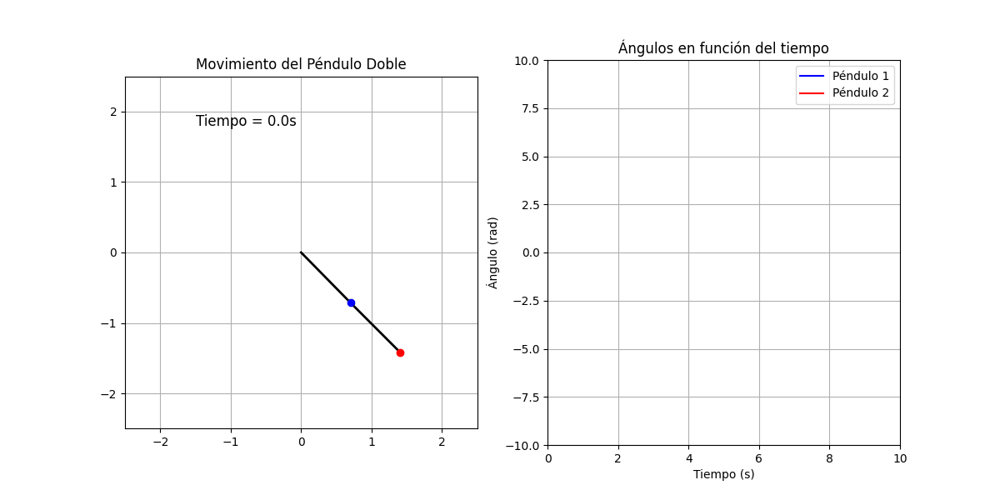

# ⏰ Péndulo Doble en Python

Este proyecto simula el **movimiento de un péndulo doble** utilizando **Python** y **matplotlib**. Se implementa la solución numérica mediante el **método de Runge-Kutta de 4to orden (RK4)** para resolver las ecuaciones diferenciales del sistema. Además, la animación incluye la visualización de la trayectoria y gráficas de los ángulos en función del tiempo.

---

## 📚 Contenido del proyecto

- **`PENDULO_DOBLE.py`**: Código principal que simula el movimiento del péndulo doble.
- **`pendulo_doble.gif`**: Animación generada del péndulo en acción.
- **`README.md`**: Este archivo con la documentación del proyecto.

---

## ⚡ Instalación

Asegúrate de tener **Python 3.x** instalado. Luego, instala las dependencias necesarias con:

```bash
pip install matplotlib
```

---

## 🔄 Uso

Ejecuta el script con:

```bash
python pendulo_doble.py
```

Esto generará la animación del péndulo doble y guardará un GIF con la simulación.

---

## 🌈 Características

- ✨ Simulación en tiempo real del movimiento de un péndulo doble.
- ⚙ Implementación de la **ecuación de Lagrange** para calcular la dinámica del sistema.
- ⏰ Uso del **método de Runge-Kutta de 4to orden** para resolver las ecuaciones diferenciales.
- 📊 Gráficos de los ángulos en función del tiempo.
- 🎨 Animación interactiva con **matplotlib**.

---

## 💡 Explicación breve del código

1. **Definición de la clase `PenduloDoble`**, que hereda de `Pendulo` y `Energias`.
2. **Cálculo de la ecuación de Lagrange** para obtener las ecuaciones de movimiento.
3. **Resolución numérica** usando el **método RK4**.
4. **Animación en matplotlib** que muestra la evolución del sistema.
5. **Generación de un GIF** con la simulación.

---

## 🌟 Ejemplo de salida

Aquí tienes una vista previa de la animación generada:



---

## ✨ Contribuciones

Si deseas mejorar este proyecto, siéntete libre de hacer un **fork** y enviar un **pull request**. Toda contribución es bienvenida. ❤️

---

## 🛠️ Autor

Proyecto desarrollado por **[Johans Steven Hernandez Diaz]**.

👉 [GitHub](https://github.com/TU_USUARIO)  |  🌐 [LinkedIn](https://linkedin.com/in/TU_USUARIO)

---

## 🐟 Licencia

Este proyecto está bajo la licencia **MIT**. Puedes usarlo y modificarlo libremente. ✨


